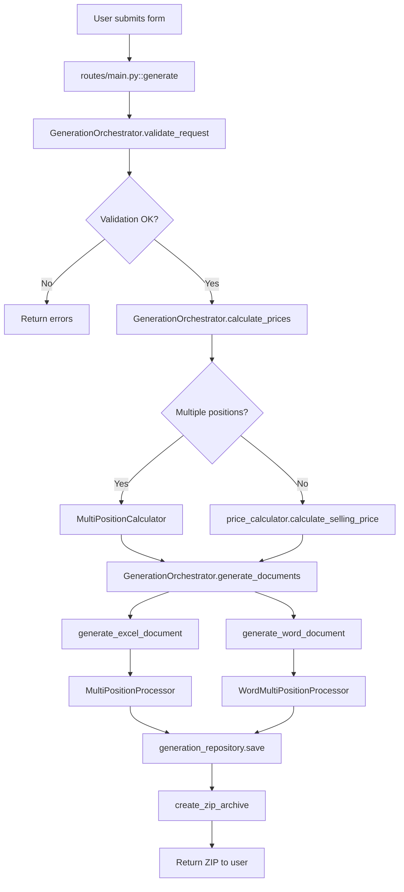

# AGENTS.md - Инструкции для AI агентов

Этот файл предоставляет контекст о структуре проекта KP Generator для AI агентов, чтобы они могли быстро понять архитектуру и найти нужные компоненты без изучения всего кода.

## Обзор проекта

**KP Generator** — веб-приложение на Flask для автоматической генерации коммерческих предложений (КП) с расчетом цен, маржинальности и формированием документов (Word, Excel).

### Основной функционал
- Расчет цен для одной и множественных позиций с единой целевой маржой
- Генерация документов (Excel + Word) с автоматическим заполнением шаблонов
- История генераций с версионированием по тендерам
- Расчет логистики с учетом типа транспорта и расстояния
- Справочники (пошлины, материалы GB, города логистики) с админ-редактированием
- Расширенная аналитика с графиками и отчетами
- REST API для интеграции с внешними системами
- AI консультант для работы с данными и консультаций

### Технологии
- **Backend**: Flask 2.3.3, Python 3.12+
- **Database**: Microsoft SQL Server (mssql+pyodbc), SQLAlchemy ORM — см. [docs/MSSQL_SETUP.md](docs/MSSQL_SETUP.md)
- **Migrations**: Alembic
- **Sessions**: Redis (опционально, с fallback на cookie-based)
- **Templates**: Jinja2
- **Forms**: WTForms, Flask-WTF
- **Testing**: pytest

## Архитектура

Проект организован по принципам **Clean Architecture** с четким разделением ответственности между слоями:

```
┌─────────────────────────────────────────┐
│     Presentation Layer                  │
│  (routes/, presentation/)               │
│  - Blueprints, Forms, UI Helpers       │
└──────────────┬──────────────────────────┘
               │
┌──────────────▼──────────────────────────┐
│     Business Layer                      │
│  (business/)                            │
│  - Price Calculator, Document Generator │
└──────────────┬──────────────────────────┘
               │
┌──────────────▼──────────────────────────┐
│     Service Layer                       │
│  (services/)                            │
│  - Orchestrator, Calculators, Analytics│
└──────────────┬──────────────────────────┘
               │
┌──────────────▼──────────────────────────┐
│     Data Layer                          │
│  (database/, models/)                   │
│  - Repositories, ORM Models            │
└──────────────┬──────────────────────────┘
               │
┌──────────────▼──────────────────────────┐
│     Core Layer                          │
│  (core/)                                │
│  - Config, Extensions, Errors          │
└─────────────────────────────────────────┘
```

### Слои архитектуры

1. **Core Layer** (`app/core/`) — Инфраструктурный слой
   - Конфигурация, расширения Flask, обработка ошибок
   - Не зависит от других слоев

2. **Domain Layer** (`app/models/`) — Доменные модели
   - ORM модели (UserRecord, GenerationHistoryRecord, AuditLogRecord)
   - Определяют структуру данных

3. **Data Layer** (`app/database/`) — Слой данных
   - CRUD операции, репозитории
   - Абстракция доступа к БД

4. **Business Layer** (`app/business/`) — Бизнес-логика
   - Расчет цен, генерация документов
   - Чистая бизнес-логика без зависимостей от Flask

5. **Service Layer** (`app/services/`) — Сервисы
   - Оркестрация процессов, аналитика, импорт
   - Координация между слоями

6. **Presentation Layer** (`app/presentation/`, `app/routes/`) — Слой представления
   - Формы, валидаторы, маршруты
   - Взаимодействие с пользователем

## Структура папок

### `app/` — Основной код приложения

#### `app/core/` — Ядро приложения
- **`config.py`** — Загрузка конфигурации из `.env`, `config/settings.json`, `config/environments/`
- **`extensions.py`** — Инициализация CSRF, Login Manager, SQLAlchemy
- **`errors.py`** — Обработчики HTTP ошибок (404, 500, 503)
- **`exceptions.py`** — Кастомные исключения (ValidationError, CalculationError, DocumentGenerationError)
- **`cache.py`** — Кэширование данных справочников
- **`redis_session.py`** — Настройка Redis для сессий Flask (с fallback)

#### `app/models/` — Доменные модели
- **`models.py`** — Все ORM модели:
  - `UserRecord` — пользователи системы
  - `GenerationHistoryRecord` — история генераций КП
  - `AuditLogRecord` — логи аудита действий пользователей

#### `app/database/` — Работа с базой данных
- **`database.py`** — CRUD операции, работа с историей генераций, статистика
- **`service.py`** — Сервисы работы с БД, инициализация схемы

#### `app/auth/` — Аутентификация и авторизация
- **`security.py`** — Декораторы безопасности (`@admin_required`)

#### `app/business/` — Бизнес-логика
- **`price_calculator.py`** — Расчет продажных цен для одной позиции (`calculate_selling_price()`)
- **`document_generator.py`** — Генерация Excel и Word документов, создание ZIP архивов
- **`interfaces.py`** — Интерфейсы для бизнес-логики

#### `app/presentation/` — Слой представления
- **`forms.py`** — Формы WTForms (LoginForm, RegistrationForm, GenerateForm и др.)
- **`ui.py`** — UI хелперы (иконки, форматирование чисел, контекст для шаблонов)
- **`helpers.py`** — Вспомогательные функции (валидация, извлечение позиций из формы)
- **`validators.py`** — Кастомные валидаторы для форм

#### `app/routes/` — Маршруты (Blueprints)
- **`__init__.py`** — Регистрация всех blueprints
- **`main.py`** — Основные страницы (генерация КП `/`, история `/history`, аналитика `/analytics`)
- **`auth.py`** — Авторизация, регистрация, профиль (`/profile`)
- **`admin.py`** — Административная панель (`/admin/*`)
- **`api.py`** — REST API endpoints (`/api/v1/*`)
- **`api_docs.py`** — Swagger документация API (`/api/docs/`)
- **`health.py`** — Health check endpoints (`/health`, `/healthz`)

#### `app/services/` — Сервисы и утилиты
- **`repositories.py`** — Репозитории для работы с моделями (Repository pattern):
  - `user_repository` — работа с пользователями
  - `generation_repository` — работа с историей генераций
- **`generation_orchestrator.py`** — Оркестратор генерации КП (координирует весь процесс)
- **`multi_position_calculator.py`** — Калькулятор множественных позиций с единой маржой
- **`multi_position_processor.py`** — Обработка множественных позиций в Excel документах
- **`word_multi_position_processor.py`** — Обработка множественных позиций в Word документах
- **`logistics_calculator.py`** — Расчет логистики с учетом типа транспорта и расстояния
- **`excel_importer.py`** — Импорт позиций из Excel файлов
- **`analytics_service.py`** — Сервис аналитики (графики, статистика)
- **`analytics_enhancements.py`** — Расширенная аналитика (маржинальность, динамика курсов)
- **`audit_service.py`** — Аудит действий пользователей
- **`content_manager.py`** — Управление контентом (заказы, инструкции, шаблоны)
- **`export_service.py`** — Экспорт данных в различные форматы
- **`feedback.py`** — Обратная связь от пользователей
- **`healthcheck.py`** — Проверка здоровья системы (БД, шаблоны, справочники)
- **`datasets.py`** — Управление справочниками (пошлины, материалы, логистика) с версионированием
- **`datasets_validator.py`** — Валидация справочников при загрузке

### `ai_agent/` — AI консультант (отдельный модуль)
- **`agent.py`** — Главный класс AIAgent, оркестратор всех функций
- **`analytics_helper.py`** — Работа с данными 1С (CSV)
- **`logistics_helper.py`** — Расчет логистики через AI
- **`materials_helper.py`** — Поиск материалов через AI
- **`duty_helper.py`** — Расчет пошлин через AI
- **`intent_extractor.py`** — Извлечение намерений из запросов пользователей
- **`validators.py`** — Валидация параметров запросов
- **`formatters.py`** — Форматирование ответов AI
- **`cache_manager.py`** — Управление кешированием ответов AI
- **`metrics.py`** — Сбор метрик производительности
- **`data/`** — Данные для AI агента (CSV файлы, документация)

### `config/` — Конфигурационные файлы
- **`settings.json`** — Основные настройки приложения (константы расчета, пагинация, Redis)
- **`environments/`** — Профили окружений:
  - `development.json` — настройки разработки
  - `staging.json` — настройки staging
  - `production.json` — настройки production
- **`gb_materials.json`** — Справочник материалов GB
- **`logistics_*.json`** — Справочники городов логистики (cities, ekb_rf_cities, main_cities, trail_cities)
- **`tnved_catalog.json`** — Каталог ТН-ВЭД
- **`orders_documents.json`** — Документы заказов
- **`task_templates.json`** — Шаблоны задач
- **`versions/`** — Версии справочников для версионирования изменений

### `migrations/` — Миграции Alembic
- **`env.py`** — Конфигурация Alembic
- **`versions/`** — Файлы миграций (автогенерация через `alembic revision --autogenerate`)

### `templates/` — HTML шаблоны Jinja2
- **`base.html`** — Базовый шаблон
- **`index.html`** — Главная страница (генерация КП)
- **`history.html`** — История генераций
- **`analytics.html`** — Аналитика
- **`profile.html`** — Профиль пользователя
- **`admin/`** — Шаблоны админ-панели

### `templates_docs/` — Шаблоны документов
- **`template.xlsx`** — Шаблон Excel для КП
- **`template.docx`** — Шаблон Word для КП
- **`Запрос.xlsx`** — Шаблон для импорта позиций

### `static/` — Статические файлы
- **`css/style.css`** — Основные стили приложения
- **`favicon.ico`** — Иконка сайта
- **`instructions/`** — Текстовые инструкции (4 файла .txt)
- **`orders/`** — PDF документы заказов (распоряжения)
- **`task_templates/`** — Шаблоны задач (Word, Excel документы)
- **`ТН-ВЭД-ТД-для-менеджеров-с-ключевыми-словами.csv`** — CSV справочник ТН-ВЭД для импорта

### `tests/` — Тесты
Структура повторяет `app/`:
- **`conftest.py`** — Фикстуры pytest
- **`test_smoke_health.py`** — Smoke тесты
- **`business/`** — Тесты бизнес-логики
- **`routes/`** — Тесты маршрутов
- **`services/`** — Тесты сервисов
- **`database/`** — Тесты работы с БД

### `scripts/` — Утилиты управления
- **`manage_users.py`** — Управление пользователями (list, reset-password, set-role)
- **`manage_migrations.py`** — Управление миграциями (status, upgrade, downgrade, history)
- **`validate_datasets.py`** — Валидация справочников

### `docs/` — Документация
- **`SETUP.md`** — Установка и настройка
- **`COMPLETE_GUIDE.md`** — Полное руководство
- **`PROJECT_STRUCTURE.md`** — Структура проекта
- **`USER_MANAGEMENT.md`** — Управление пользователями
- **`REDIS_SETUP.md`** — Настройка Redis
- **`AI_AGENT_SETUP.md`** — Настройка AI агента
- **`AI_AGENT_USER_GUIDE.md`** — Руководство пользователя AI
- **`CHANGELOG.md`** — Журнал изменений

## Ключевые компоненты и их роли

### Entry Point
- **`app.py`** → **`app/__init__.py::create_app()`** — Фабрика приложения Flask
  - Инициализирует все компоненты
  - Настраивает конфигурацию, расширения, маршруты
  - Создает необходимые директории
  - Применяет миграции при старте

### Generation Flow (Основной процесс генерации КП)
```
routes/main.py::generate()
  ↓
GenerationOrchestrator.validate_request()
  ↓
GenerationOrchestrator.calculate_prices()
  ├─ MultiPositionCalculator (множественные позиции)
  └─ price_calculator.calculate_selling_price() (одна позиция)
  ↓
GenerationOrchestrator.generate_documents()
  ├─ generate_excel_document() → MultiPositionProcessor
  └─ generate_word_document() → WordMultiPositionProcessor
  ↓
generation_repository.save() → database/database.py
  ↓
create_zip_archive()
  ↓
Return ZIP to user
```

### Price Calculation (Расчет цен)
- **`business/price_calculator.py`** — Расчет для одной позиции
  - Учитывает: закуп, логистику, пошлину, конвертацию, кредит, маржу
  - Формула: `selling_price = total_cost / (1 - margin_percent / 100)`
- **`services/multi_position_calculator.py`** — Расчет для множественных позиций
  - Обеспечивает единую целевую маржу для всех позиций
  - Распределяет логистику пропорционально весу

### Document Generation (Генерация документов)
- **`business/document_generator.py`** — Основные функции генерации
  - `generate_excel_document()` — создание Excel файла
  - `generate_word_document()` — создание Word файла
  - `create_zip_archive()` — упаковка в ZIP
- **`services/multi_position_processor.py`** — Обработка множественных позиций в Excel
  - Автоматическое добавление строк
  - Копирование стилей и формул
  - Обновление итоговых расчетов

### Data Access (Доступ к данным)
- **`services/repositories.py`** — Repository pattern
  - Абстракция доступа к данным
  - `user_repository`, `generation_repository`
- **`database/database.py`** — CRUD операции
  - Работа с историей генераций
  - Статистика пользователей

### Configuration (Конфигурация)
- **`core/config.py`** — Загрузка конфигурации
  - Порядок загрузки: `.env` → `config/environments/{APP_ENV}.json` → `config/settings.json`
  - Переменные окружения имеют приоритет
- **`config/settings.json`** — Основные настройки
  - Константы расчета (курсы, коэффициенты)
  - Настройки пагинации
  - Параметры Redis

## Поток данных при генерации КП



## Важные файлы

### Точки входа
- **`app.py`** — Запуск приложения
- **`app/__init__.py::create_app()`** — Фабрика приложения Flask

### Основные маршруты (Endpoints)

#### `app/routes/main.py` — Основные страницы
- **`GET /`** — Главная страница (генерация КП)
- **`POST /`** — Обработка формы генерации КП
- **`GET /history`** — История генераций с пагинацией
- **`GET /history/details/<id>`** — Детали конкретной генерации
- **`GET /history/tender/<tender_number>`** — История по номеру тендера
- **`GET /history/companies`** — Список компаний
- **`GET /history/export`** — Экспорт истории (Excel/CSV)
- **`GET /analytics`** — Страница аналитики
- **`POST /analytics`** — Обработка загрузки Excel для анализа
- **`GET /ai-agent`** — Страница AI консультанта
- **`POST /api/ai-agent/chat`** — API для чата с AI агентом
- **`GET /feedback`** — Страница обратной связи
- **`POST /feedback`** — Отправка обратной связи
- **`GET /gb-analogs`** — Справочник материалов GB
- **`GET /duty`** — Справочник пошлин
- **`GET /orders`** — Страница заказов
- **`GET /templates-library`** — Библиотека шаблонов
- **`GET /instructions`** — Инструкции

#### `app/routes/auth.py` — Авторизация
- **`GET /profile`** — Страница профиля
- **`POST /profile`** — Обработка входа/регистрации/обновления профиля
- **`POST /profile/delete`** — Удаление аккаунта

#### `app/routes/admin.py` — Административная панель
- **`GET /admin`** — Главная страница админ-панели
- **`GET /admin/stats`** — Статистика
- **`GET /admin/users`** — Управление пользователями
- **`GET /admin/duty`** — Управление пошлинами
- **`GET /admin/materials`** — Управление материалами GB
- **`GET /admin/logistics`** — Управление логистикой
- **`GET /admin/ai-agent`** — Мониторинг AI агента
- **`GET /admin/audit`** — Логи аудита

#### `app/routes/api.py` — REST API
- **`GET /api/v1/health`** — Health check
- **`GET /api/v1/generations`** — Список генераций (с пагинацией)
- **`GET /api/v1/generations/<id>`** — Детали генерации
- **`POST /api/v1/calculate`** — Расчет цен
- **`POST /api/v1/logistics/calculate`** — Расчет логистики
- **`GET /api/v1/duty/search`** — Поиск пошлин
- **`GET /api/v1/materials/gb`** — Материалы GB
- **`GET /api/v1/logistics/cities`** — Города логистики
#### `app/routes/health.py` — Health Check
- **`GET /health`** — Проверка здоровья системы
- **`GET /healthz`** — Альтернативный endpoint для health check

#### `app/routes/api_docs.py` — Swagger документация
- **`GET /api/docs/`** — Интерактивная документация API

### Бизнес-логика
- **`app/services/generation_orchestrator.py`** — Оркестратор генерации (координирует весь процесс)
  - `GenerationOrchestrator.validate_request()` — валидация данных
  - `GenerationOrchestrator.calculate_prices()` — расчет цен
  - `GenerationOrchestrator.generate_documents()` — генерация документов
- **`app/business/price_calculator.py`** — Расчет цен для одной позиции
  - `calculate_selling_price()` — основная функция расчета
- **`app/services/multi_position_calculator.py`** — Расчет для множественных позиций
  - `MultiPositionCalculator.calculate_multi_position_prices()` — расчет с единой маржой
- **`app/business/document_generator.py`** — Генерация документов
  - `generate_excel_document()` — создание Excel
  - `generate_word_document()` — создание Word
  - `create_zip_archive()` — упаковка в ZIP

### Модели данных
- **`app/models/models.py`** — Все ORM модели:
  - `UserRecord` — пользователи
  - `GenerationHistoryRecord` — история генераций (с полем `positions_data` для множественных позиций)
  - `AuditLogRecord` — логи аудита
  - `AIAgentUsageRecord` — мониторинг использования AI агента

### Конфигурация
- **`config/settings.json`** — Основные настройки:
  - `margin_percent` — маржа по умолчанию (20%)
  - `calculation_constants` — константы расчета (курсы, коэффициенты)
  - `redis` — настройки Redis
  - `session` — настройки сессий
- **`.env`** — Переменные окружения (не в git):
  - `APP_ENV` — окружение (development/staging/production)
  - `DATABASE_URL` — строка подключения к БД
  - `SECRET_KEY` — секретный ключ Flask
  - `REDIS_HOST`, `REDIS_PORT` — настройки Redis
  - `USE_WAITRESS` — использование Waitress для production

## Формы и валидация

### Основные формы (`app/presentation/forms.py`)

- **`LoginForm`** — Авторизация (username, password, remember_me)
- **`RegistrationForm`** — Регистрация (username, last_name, first_name, password, confirm_password)
- **`ProfileUpdateForm`** — Обновление профиля (username, last_name, first_name, new_password)
- **`GenerateForm`** — Генерация КП (множество полей для позиций, логистики, маржи)
- **`DutyItemForm`** — Добавление пошлины (product, category, duty_percent)
- **`TNVEDItemForm`** — Добавление записи ТН-ВЭД (code, description, keywords, duty_percent)
- **`LogisticsCityForm`** — Добавление города логистики

### Валидация

- **`app/presentation/validators.py`** — Кастомные валидаторы:
  - Валидация форм генерации КП
  - Проверка данных позиций
  - Валидация справочников
- **`app/presentation/helpers.py`** — Вспомогательные функции:
  - `extract_positions_from_form()` — извлечение позиций из формы
  - `validate_form_data()` — валидация данных формы
  - `check_templates_exist()` — проверка наличия шаблонов

## Структура данных

### Формат позиций в форме

Для множественных позиций используются поля с суффиксами:
- Первая позиция: `product`, `quantity`, `cost_price`, `weight`, `duty_percent`, и т.д.
- Вторая позиция: `product_2`, `quantity_2`, `cost_price_2`, `weight_2`, `duty_percent_2`, и т.д.
- Третья позиция: `product_3`, `quantity_3`, и т.д.

### JSON формат позиций в БД

Поле `positions_data` в `GenerationHistoryRecord` содержит JSON массив:
```json
[
  {
    "product": "Наименование товара",
    "quantity": "10",
    "cost_price": "1000",
    "weight": "5",
    "drawing_number": "Ч-001",
    "material": "Сталь",
    "duty_percent": "5"
  },
  {
    "product": "Наименование товара 2",
    "quantity": "5",
    ...
  }
]
```

### Константы расчета (`config/settings.json`)

```json
{
  "calculation_constants": {
    "conversion_rate": 11.5,        // Курс юаня к рублю
    "logistics_cnr_ratio": 0.3,     // Доля логистики КНР (30%)
    "logistics_rf_ratio": 0.7,      // Доля логистики РФ (70%)
    "conversion_fee_rate": 0.032,   // Комиссия за конвертацию (3.2%)
    "credit_rate": 0.16,            // Ставка кредита (16% годовых)
    "vat_rate": 0.22                // НДС (22%)
  }
}
```

## Импорты и зависимости

### Правила импорта

1. **Из core**: `from app.core.config import load_config`
2. **Из models**: `from app.models.models import UserRecord`
3. **Из business**: `from app.business.price_calculator import calculate_selling_price`
4. **Из services**: `from app.services.repositories import user_repository`
5. **Из presentation**: `from app.presentation.forms import LoginForm`
6. **Из routes**: Импорты только внутри `routes/__init__.py`

### Зависимости между слоями

```
routes/ → presentation/ → business/ → services/ → database/ → models/
   ↓         ↓              ↓           ↓            ↓
templates/  forms/      calculators/  repositories/  ORM models
```

Каждый слой зависит только от слоев ниже него.

## Логирование

- **Настройка**: `app/core/config.py::setup_logging()`
- **Логи**: `logs/kp_generator.log` (основной), `logs/kp_generator_errors.log` (ошибки)
- **Ротация**: Максимальный размер 10MB, 10 файлов
- **Уровни**: DEBUG, INFO, WARNING, ERROR, CRITICAL
- **Настройка**: Через `LOG_LEVEL` в `.env` или `config/environments/{env}.json`

## Тестирование

### Структура тестов

Структура `tests/` повторяет структуру `app/`:
- `tests/business/` — тесты бизнес-логики
- `tests/routes/` — тесты маршрутов
- `tests/services/` — тесты сервисов
- `tests/database/` — тесты работы с БД
- `tests/core/` — тесты ядра
- `tests/presentation/` — тесты форм и валидаторов

### Запуск тестов

```bash
# Все тесты
pytest

# Конкретный файл
pytest tests/business/test_price_calculator.py

# С покрытием
pytest --cov=app --cov-report=html

# Smoke тесты
pytest tests/test_smoke_health.py -v
```

### Фикстуры (`tests/conftest.py`)

- `app` — экземпляр Flask приложения для тестов
- `client` — тестовый клиент Flask
- `db_session` — сессия БД для тестов
- `test_user` — тестовый пользователь

## Конвенции и паттерны

### Архитектурные паттерны

1. **Repository Pattern** (`services/repositories.py`)
   - Абстракция доступа к данным
   - Упрощает тестирование и замену реализации

2. **Service Layer Pattern** (`services/`)
   - Бизнес-логика в сервисах, не в routes
   - Координация между слоями

3. **Factory Pattern**
   - `create_app()` — фабрика приложения Flask
   - `DataSourceFactory` — создание источников данных для AI агента

4. **Blueprint Organization**
   - Каждый функциональный блок в отдельном blueprint
   - Регистрация в `routes/__init__.py`

### Правила кодирования

- **Форматирование**: Black (настройки в `pyproject.toml`)
- **Линтинг**: Ruff (настройки в `pyproject.toml`)
- **Тестирование**: pytest (структура `tests/` повторяет `app/`)
- **Типизация**: Используются type hints где возможно
- **Документация**: Docstrings для всех публичных функций и классов

### Обработка ошибок

- Кастомные исключения в `core/exceptions.py`:
  - `ValidationError` — ошибки валидации
  - `CalculationError` — ошибки расчета
  - `DocumentGenerationError` — ошибки генерации документов
- Обработчики ошибок в `core/errors.py`:
  - 404 — страница не найдена
  - 500 — внутренняя ошибка сервера
  - 503 — сервис недоступен (health check)

### Конфигурация

Порядок загрузки конфигурации:
1. Переменные окружения (`.env`)
2. Профиль окружения (`config/environments/{APP_ENV}.json`)
3. Основные настройки (`config/settings.json`)

Переменные окружения имеют наивысший приоритет.

## База данных

### Модели
- **`UserRecord`** — пользователи (id, username, password_hash, role, created_at, last_login)
- **`GenerationHistoryRecord`** — история генераций (id, company, product, positions_data, final_price, timestamp, user_id)
- **`AuditLogRecord`** — логи аудита (id, user_id, action_type, description, created_at)

### Миграции
- Используется Alembic для управления схемой БД
- Команды: `alembic upgrade head`, `alembic revision --autogenerate`
- Миграции применяются автоматически при старте приложения

### Подключение
- Единственная БД: **Microsoft SQL Server** (строка подключения в `DATABASE_URL`, формат `mssql+pyodbc://...`). Пошаговая настройка: [docs/MSSQL_SETUP.md](docs/MSSQL_SETUP.md)

## Справочники

Справочники хранятся в JSON файлах в `config/`:
- **Пошлины** — управление через админ-панель `/admin/duty`
- **Материалы GB** — `config/gb_materials.json`
- **Логистика** — `config/logistics_*.json` (несколько файлов по типам городов)
- **ТН-ВЭД** — `config/tnved_catalog.json`

Все изменения версионируются в `config/versions/`.

## AI Agent модуль

Отдельный модуль в `ai_agent/` для консультаций:
- Использует OpenRouter API
- Работает с данными 1С, логистикой, материалами
- Кэширование ответов через Redis
- Мониторинг использования через админ-панель `/admin/ai-agent`

Подробнее: `docs/AI_AGENT_SETUP.md`, `docs/AI_AGENT_USER_GUIDE.md`

## Полезные ссылки

- **Документация**: `docs/COMPLETE_GUIDE.md` — полное руководство
- **Установка**: `docs/SETUP.md` — инструкция по установке
- **Структура**: `docs/PROJECT_STRUCTURE.md` — детальное описание структуры
- **Правила работы**: `.cursorrules` — правила для AI агентов

## Быстрый старт для AI агента

При работе с проектом:

1. **Найти точку входа**: `app/__init__.py::create_app()` или `app/routes/main.py::generate()`
2. **Понять поток данных**: Следуйте по цепочке от routes → services → business → database
3. **Использовать репозитории**: Доступ к данным через `services/repositories.py`
4. **Проверить конфигурацию**: Настройки в `config/settings.json` и `.env`
5. **Следовать паттернам**: Repository для данных, Service для логики, Business для расчетов

### Типичные задачи и где их решать

- **Добавить новый маршрут**: `app/routes/` (создать новый blueprint или добавить в существующий)
- **Добавить новую форму**: `app/presentation/forms.py`
- **Добавить бизнес-логику**: `app/business/` (чистая логика) или `app/services/` (координация)
- **Добавить работу с БД**: `app/services/repositories.py` (новый репозиторий) или `app/database/database.py` (CRUD)
- **Добавить новую модель**: `app/models/models.py` + миграция Alembic
- **Добавить валидацию**: `app/presentation/validators.py` или кастомный валидатор в форме
- **Добавить обработку ошибок**: `app/core/exceptions.py` (новое исключение) + `app/core/errors.py` (обработчик)
- **Изменить конфигурацию**: `config/settings.json` или `config/environments/{env}.json`
- **Добавить тест**: Соответствующая папка в `tests/` (структура повторяет `app/`)

### Ключевые функции и их сигнатуры

**Расчет цен:**
```python
# Одна позиция
calculate_selling_price(
    quantity: int,
    purchase_cost: float,
    logistics_rub: float,
    duty_percent: float,
    weight: float,
    delivery_time: int,
    margin_percent: float = 30,
    config: Optional[Dict[str, Any]] = None
) -> float

# Множественные позиции
MultiPositionCalculator.calculate_multi_position_prices(
    positions: List[Dict[str, Any]],
    logistics_rub: float,
    margin_percent: float,
    config: Dict[str, Any]
) -> Dict[str, Any]
```

**Генерация документов:**
```python
generate_excel_document(
    template_path: str,
    form_data: Dict[str, Any],
    final_price: Optional[float],
    general_price: Optional[float],
    position_prices: List[Dict[str, Any]],
    manager_fio: str
) -> BytesIO

generate_word_document(
    template_path: str,
    form_data: Dict[str, Any],
    final_price: Optional[float],
    general_price: Optional[float],
    position_prices: List[Dict[str, Any]],
    manager_fio: str
) -> BytesIO
```

**Работа с репозиториями:**
```python
# Пользователи
user_repository.get_by_id(user_id: int) -> Optional[User]
user_repository.get_by_username(username: str) -> Optional[User]
user_repository.create_user(...) -> Optional[User]

# Генерации
generation_repository.save(...) -> Optional[int]
generation_repository.get_by_id(generation_id: int) -> Optional[Dict]
generation_repository.get_history(page: int, per_page: int, ...) -> Dict

# Контакты заказчиков
```

## Важные замечания

- **Не изменяйте** файлы в `migrations/versions/` вручную — используйте `alembic revision --autogenerate`
- **Не коммитьте** `.env` файл — он содержит секреты
- **Тесты** должны покрывать новую функциональность
- **Миграции** применяются автоматически при старте, но проверяйте через `alembic current`
- **Redis** опционален — приложение работает с fallback на cookie-based сессии
- **Импорты** должны следовать структуре слоев — не импортируйте из верхних слоев в нижние
- **Формы** используют WTForms — все валидаторы должны быть в `validators.py` или в форме
- **Исключения** должны быть из `app.core.exceptions` — не используйте стандартные исключения для бизнес-логики
- **Логирование** использует стандартный Python logging — настройка через `core/config.py`
- **Конфигурация** загружается в порядке приоритета: `.env` > `environments/{env}.json` > `settings.json`

## Дополнительная информация

### Версионирование справочников

При изменении справочников через админ-панель:
1. Создается копия в `config/versions/` с timestamp
2. Обновляется основной файл в `config/`
3. Версии хранятся для возможности отката

### Кэширование

- **Справочники**: Кэшируются в памяти через `app/core/cache.py` (LRU cache)
- **AI ответы**: Кэшируются в Redis через `ai_agent/cache_manager.py`
- **Инвалидация**: При изменении справочников кэш очищается автоматически

### Сессии Flask

- **Redis сессии** (если Redis доступен): Хранятся в Redis, ключ `session:{session_id}`
- **Cookie сессии** (fallback): Хранятся в cookie браузера (ограничение 4093 байт)
- **Настройка**: `app/core/redis_session.py` автоматически выбирает тип сессии

### Аудит действий

Все важные действия логируются в `AuditLogRecord`:
- Вход/выход пользователей
- Создание/изменение/удаление генераций
- Изменение справочников (только через админ-панель)
- Использование AI агента

Доступ через `/admin/audit` для администраторов.

## Работа ключевых компонентов

### Импорт позиций из Excel

**Файл**: `app/services/excel_importer.py`

Поддерживает два формата:
1. **С заголовками** — автоматическое определение колонок по названиям
2. **Фиксированные ячейки** — данные в фиксированных ячейках (шаблон `Запрос.xlsx`)

**Функция**: `parse_positions_from_excel(file_path: str) -> List[Dict[str, Any]]`

**Обработка**: 
- Валидация данных
- Проверка согласованности цены за шт. и цены за кг
- Автоматический расчет недостающих значений

### Расчет логистики

**Файл**: `app/services/logistics_calculator.py`

**Функция**: `calculate_logistics(...) -> Dict[str, Any]`

**Параметры**:
- `weight_kg` — вес груза
- `city_price` — базовая стоимость доставки
- `transport_type` — тип транспорта (`truck` или `trail`)
- `distance_from_ekb_km` — расстояние от Екатеринбурга
- `is_main_route` — город на основном маршруте

**Логика**:
- Базовая цена из справочника
- Надбавка за расстояние (если > порога)
- Коэффициент для типа транспорта
- Скидка для основных маршрутов

### Аналитика

**Файлы**: 
- `app/services/analytics_service.py` — базовая аналитика
- `app/services/analytics_enhancements.py` — расширенная аналитика

**Возможности**:
- Анализ загруженных Excel файлов (тендеры/продукция)
- Анализ маржинальности по истории генераций
- Динамика курсов валют
- Интерактивные отчеты с графиками

**Маршруты**: `/analytics` (GET/POST)

### Управление справочниками

**Файл**: `app/services/datasets.py`

**Функции**:
- `load_duty_rates()` — загрузка пошлин
- `load_gb_materials()` — загрузка материалов GB
- `load_logistics_cities()` — загрузка городов логистики
- `save_duty_rates()` — сохранение пошлин (с версионированием)
- `init_app()` — инициализация при старте приложения

**Версионирование**: При изменении создается копия в `config/versions/` с timestamp

**Кэширование**: Данные кэшируются в памяти через LRU cache (`app/core/cache.py`)

### Работа с репозиториями

**Файл**: `app/services/repositories.py`

**Паттерн**: Repository Pattern для абстракции доступа к данным

**Репозитории**:
- `user_repository` — `UserRepository` класс
- `generation_repository` — `GenerationRepository` класс  

**Использование**:
```python
from app.services.repositories import user_repository, generation_repository

# Получить пользователя
user = user_repository.get_by_id(user_id)

# Сохранить генерацию
generation_id = generation_repository.save(...)

# Получить историю
history = generation_repository.get_history(page=1, per_page=25)
```

---

